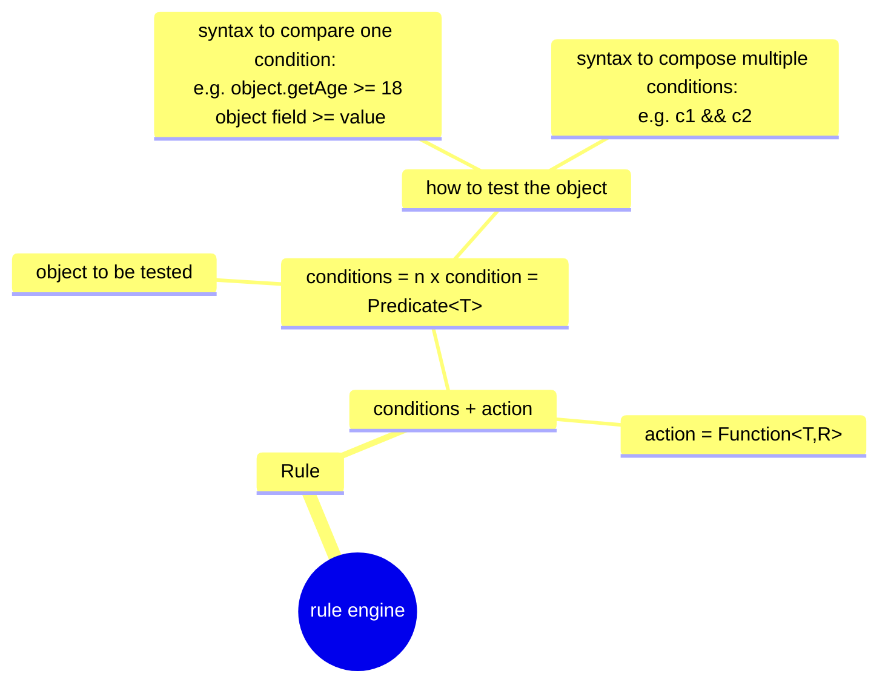

# Rule Engine
RULE = CONDITION + ACTION

```mermaid
mindmap
  root((rule engine))
    Rule
      conditions + action
        conditions = n x condition = Predicate#60;T#62;
            object to be tested
            how to test the object
                syntax to compare one condition: <br/>e.g. object.getAge >= 18<br/> object field >= value
                syntax to compose multiple conditions: <br/>e.g. c1 && c2
        action = Function#60;T,R#62;
    
```
