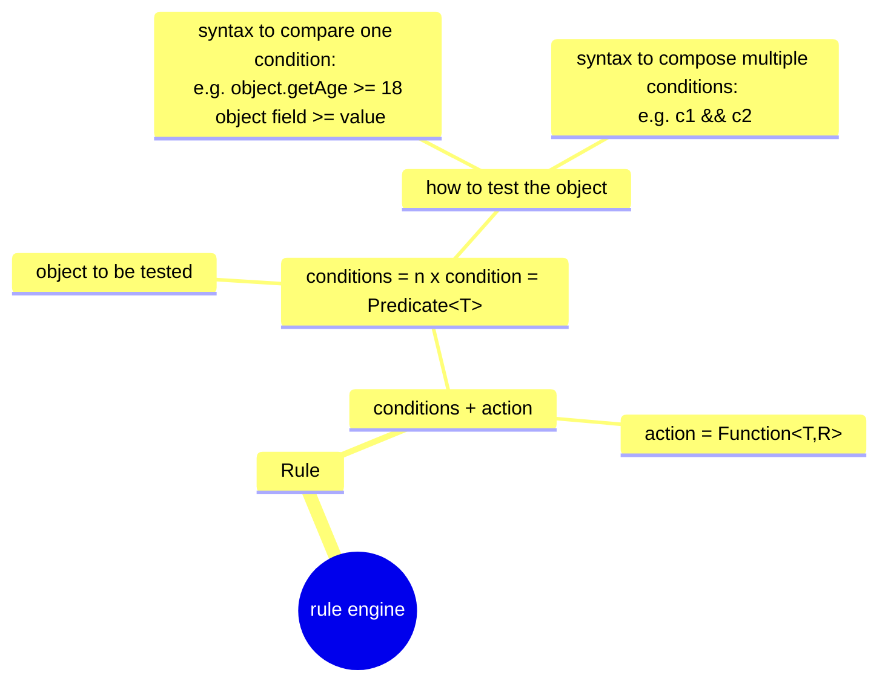

# Rule Engine
RULE = CONDITIONS + ACTION

CONDITIONS = `Predicate<T>`

ACTION = `Function<T,R>`

## Reference
- [Lightweight External Business Rules](https://www.infoq.com/articles/java-external-rules-engine/)
- [JSON query and transformation language](https://jsonata.org/)
- [Introduction to the Evrete Rule Engine](https://www.baeldung.com/java-evrete-rule-engine)
- [JSR 94: JavaTM Rule Engine API](https://jcp.org/en/jsr/detail?id=94)
